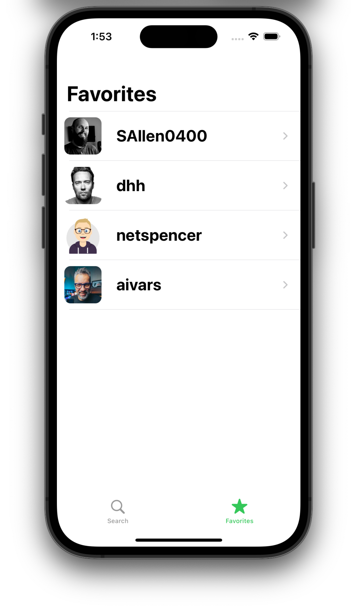

 
  Welcome to the Github Follower iOS app.   In this app a github user may be searched and a list of that users followers will be returned from the Github API. This app was build to showcase a wide variety of native iOS features and is a part of Sean Allen's course that is built to represent example of an iOS takehome project job interview.

 &nbsp; &nbsp; &nbsp;
 &nbsp; &nbsp; &nbsp;
 

 &nbsp; &nbsp; &nbsp;
 &nbsp; &nbsp; &nbsp;

